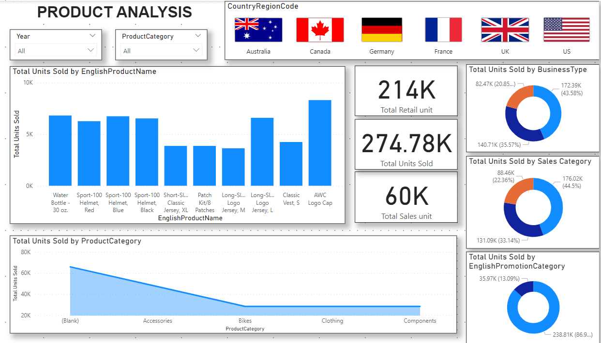

# Essies Ltd New Product Launch Data Analysis

## Introduction

This repository contains data analysis and insights generated for Essies Ltd's new product launch. The analysis focuses on segmented customer and regional targeting, retail sales, and promotional events. The analysis was conducted by Benson based on the data provided by frontline retailers.

## Table of Contents

- [Requirements](#requirements)
- [Data Model](#data-model)
- [Dashboard Highlights](#dashboard-highlights)
- [Marketing Insights](#marketing-insights)
- [Usage](#usage)
- [Contributing](#contributing)
- [License](#license)

## Requirements

- Python 3.x
- Pandas library
- Power BI or other data visualization tools

## Data Model

Benson's analysis involves creating the following reference tables:

- Product Category Table
- Product Subcategory Table

The main focus is on retail sales, categorized as High, Mid, and Low priority. The data also includes information on the country flag for interactive filtering in the report.

## Dashboard Highlights

The Essies Dashboard provides the following key insights:

- Units Sold by Category
- Total Units Sold
- Retail Units Sold
- Sales Units Sold
- Top 10 Retailers (by unit sold)
- Top Performing Products (by unit sold)
- Top Performing Subcategories (by unit sold)

## Marketing Insights

John's marketing campaign analysis includes:

- Unit Sold in Promotion Events (by reseller, no discount, customers)
- Unit Sold by Type (Components, Accessories, Clothing, Bikes)
- Unit Sold at Retail Counters

## Usage

1. Clone this repository: `git clone https://github.com/RahulKB31/Product-Analysis-Power-BI.git`
2. Navigate to the project folder: `cd Product-Analysis-Power-BI.git`
3. Install required libraries: `pip install pandas`
4. Run the analysis script: `python analyze_data.py`
5. Open the generated Power BI report for visual insights.

## Contributing

We welcome contributions to improve the analysis and insights. If you'd like to contribute, please follow these steps:

1. Fork this repository.
2. Create a new branch: `git checkout -b feature-new-insight`
3. Make your changes and commit them: `git commit -am 'Add new insight'`
4. Push to the branch: `git push origin feature-new-insight`
5. Create a pull request.

## License

This project is licensed under the [MIT License](LICENSE).

---

Feel free to modify and expand this template to fit your specific needs. Remember to replace placeholders like `your-username` and adapt the content to accurately reflect your project.
